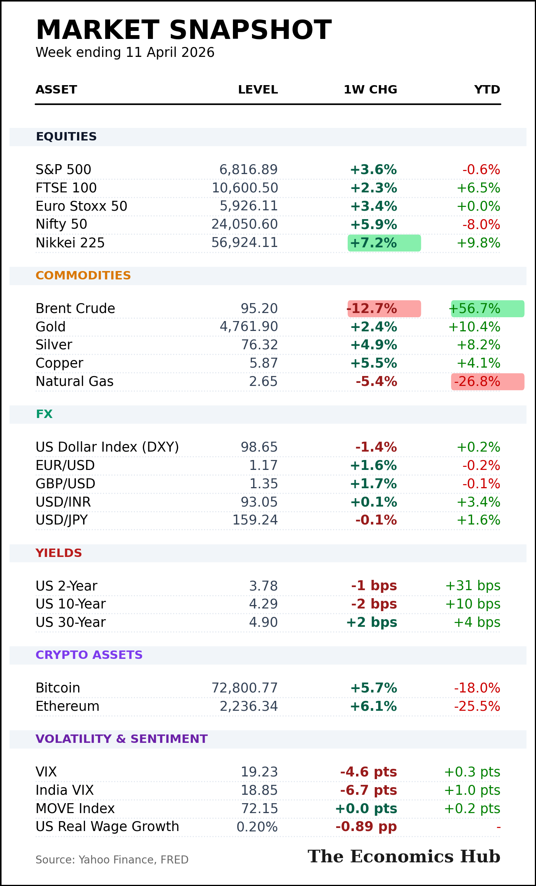
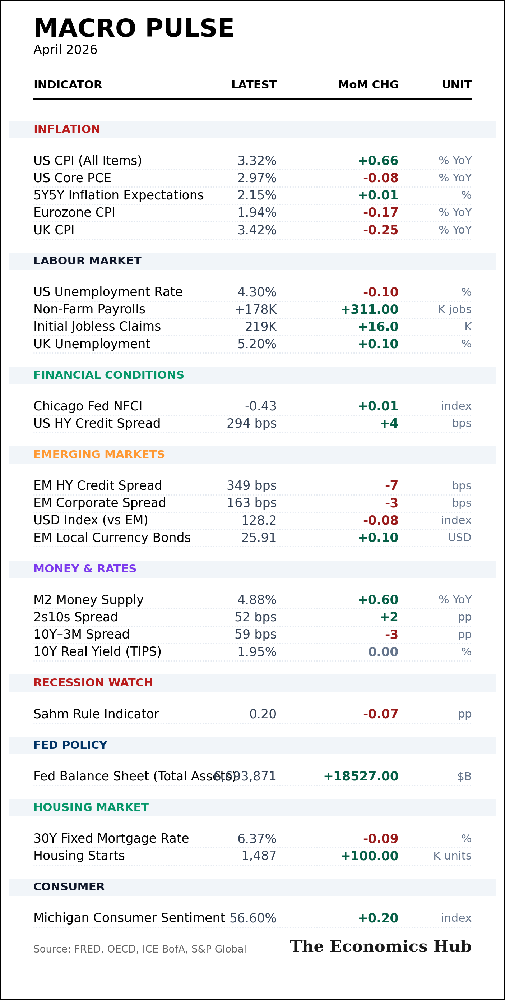
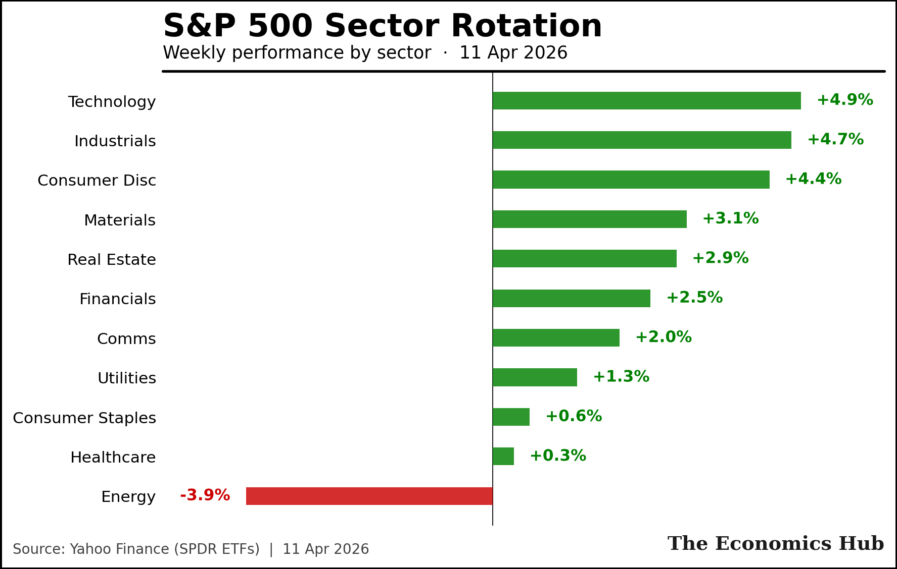
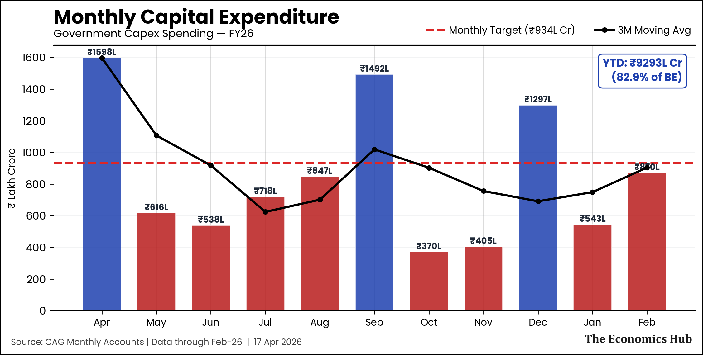
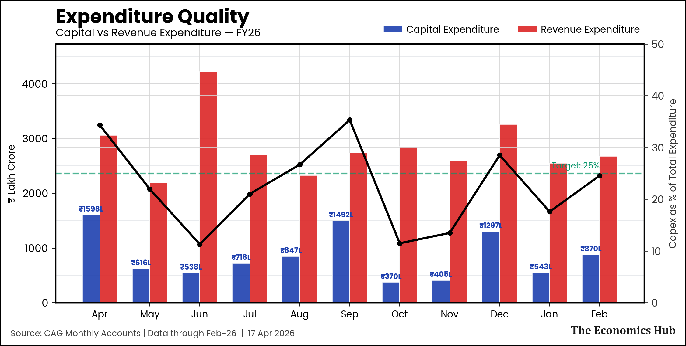
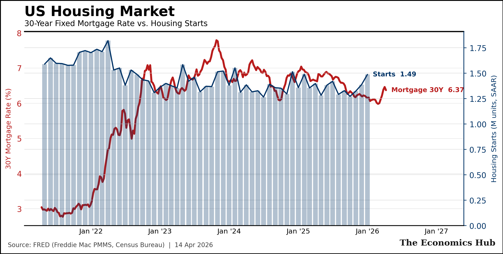

# The Economics Hub — Macro Dashboard

An automated Python pipeline tracking Global Equities, Forex, Sovereign Bonds, Commodities, and Indian Markets — published via [The Economics Hub on Substack](https://economicshub.substack.com/).

<p align="center">
  <a href="https://the-economics-hub.streamlit.app">
    
  </a>
</p>

---

## Sample Charts

| **Market Snapshot** | **Macro Pulse** |
|:---:|:---:|
|  |  |
| **Sectoral Rotations** | **Monthly Capex** |
|  |  |
| **Expenditure Quality** | **US Housing Market** |
|  |  |

*Charts update automatically after each pipeline run — images always reflect the latest data.*

---

## Reproducibility Guide

### Prerequisites

Python 3.9+ and a free FRED API key from [fred.stlouisfed.org](https://fred.stlouisfed.org/docs/api/api_key.html).

### Installation

```bash
git clone https://github.com/shreyasxi/the-economics-hub.git
cd the-economics-hub
pip install -r requirements.txt
```

### API Key Configuration

**Windows (PowerShell — permanent):**
```powershell
[System.Environment]::SetEnvironmentVariable("FRED_API_KEY", "your_key_here", "User")
# Restart terminal to take effect
```

**macOS / Linux:**
```bash
echo 'export FRED_API_KEY="your_key_here"' >> ~/.bashrc
source ~/.bashrc
```

---

## Project Structure

```
economics_hub/
├── generate_weekly.py           # Weekly global dashboard (~27 charts, runs every Saturday via CI)
├── generate_macro.py            # Monthly macro pulse (9–11 charts, runs 2nd Saturday via CI)
├── generate_india.py            # India macro dashboard (15 charts, manual dispatch)
├── generate_rbi_sentinel.py     # RBI MPC sentiment pipeline (7 charts, manual local only)
├── make_chart.py                # CLI tool for ad-hoc charts from any CSV
├── app.py                       # Streamlit 4-tab dashboard
│
├── config/
│   ├── settings.py              # Weekly indicators (Yahoo Finance + FRED tickers)
│   ├── macro_settings.py        # Monthly macro indicators (FRED + manual data)
│   └── insights.py              # Chart insights text (34 charts covered)
├── style/
│   └── economics_hub_style.py   # EconStyle — all visual constants and chart methods
├── data/
│   ├── fetchers/                # yfinance + FRED + india_fetcher data fetchers
│   ├── india_manual.csv         # Manually maintained India monthly data (PMI, GST)
│   ├── india_macro.db           # Auto-populated India SQLite database
│   └── cag_monthly_accounts.xlsx # India CAG fiscal data
├── charts/templates/            # Reusable chart template classes
├── assets/                      # Git-tracked PNGs served by Streamlit Cloud
│   ├── weekly/YYYY-MM-DD/
│   ├── macro/YYYY-MM/
│   ├── india/YYYY-MM/
│   ├── rbi_sentinel/YYYY-MM/
│   └── readme_showcase/         # Static-named flagship charts (always current)
├── output/                      # Local generation output (git-ignored)
├── rbi_sentinel/                # RBI Sentinel package (sentiment analysis)
└── docs/                        # project_context.md, instructions.md, operational docs
```

---

## Usage

### 1. Weekly Global Dashboard
Generates ~27 charts (Equities, FX, Yields, Commodities, Cross-Asset) — runs automatically every Saturday via GitHub Actions.
```bash
python generate_weekly.py
```

### 2. Macro Pulse
Generates 9–11 monthly macro charts — runs automatically on the 2nd Saturday via GitHub Actions.
```bash
python generate_macro.py
```

### 3. India Macro Dashboard
Generates 15 India-specific charts (FPI, GST, Fiscal, Credit, Trade). Update `data/india_manual.csv` and `data/cag_monthly_accounts.xlsx` first, then trigger via GitHub Actions.
```bash
python generate_india.py
```

### 4. Ad-Hoc Chart Tool
Quickly generate a styled chart from any CSV without modifying the codebase.
```bash
python make_chart.py
```

---

## Data Sources

| Source | Type | Access | Used by |
|--------|------|--------|---------|
| Yahoo Finance | Equities, FX, commodities, ETFs, VIX | Free, no key | `generate_weekly.py` |
| FRED | US yields, CPI, PCE, unemployment, M2, NFCI, credit spreads | Free API key | `generate_weekly.py`, `generate_macro.py` |
| RBI DBIE / dbnomics | India credit, FPI, IIP, forex reserves, trade | Free | `generate_india.py` (auto-fetched) |
| Manual CSV / XLSX | India PMI, GST, CAG fiscal accounts | Hand-entered monthly | `generate_india.py` |
| rbi.org.in | RBI MPC documents (HTML, cached locally) | Free | `generate_rbi_sentinel.py` |

---

## License

Licensed under **CC BY-NC 4.0** — free for personal and research use with credit to **The Economics Hub**.  
See the [LICENSE](LICENSE) file for details.
