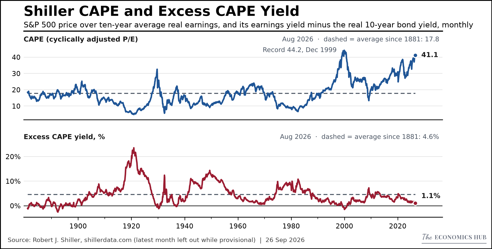
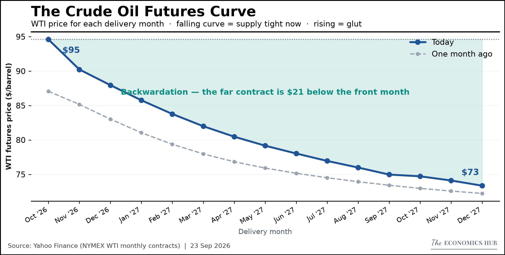
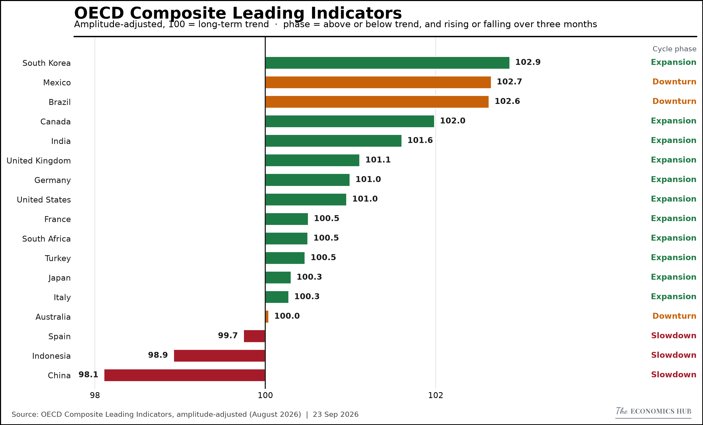

# Automated Macro Dashboard & RBI Sentiment Tracker

An automated Python pipeline tracking Global Equities, Forex, Sovereign Bonds, Commodities, and Indian Markets — published via [The Economics Hub on Substack](https://economicshub.substack.com/).

<p align="center">
  <a href="https://weekly-macro-dashboard.streamlit.app/">
    
  </a>
</p>

---

## Sample Charts

| **Market Snapshot** | **World: Shiller CAPE and Excess CAPE Yield** |
|:---:|:---:|
|  |  |
| **The Crude Oil Futures Curve** | **Fiscal Deficit** |
|  |  |
| **Expenditure Quality** | **World: OECD Composite Leading Indicators** |
|  |  |

*Charts update automatically after each pipeline run — images always reflect the latest data.*

---

## Reproducibility Guide

### Prerequisites

Python 3.9+ and a free FRED API key from [fred.stlouisfed.org](https://fred.stlouisfed.org/docs/api/api_key.html).

### Installation

```bash
git clone https://github.com/shreyasxi/the-economics-hub.git
cd the-economics-hub
pip install -r requirements.txt
```

### API Key Configuration

**Windows (PowerShell — permanent):**
```powershell
[System.Environment]::SetEnvironmentVariable("FRED_API_KEY", "your_key_here", "User")
# Restart terminal to take effect
```

**macOS / Linux:**
```bash
echo 'export FRED_API_KEY="your_key_here"' >> ~/.bashrc
source ~/.bashrc
```

---

## Project Structure

```
economics_hub/
├── app.py                       # Streamlit 4-tab dashboard
├── generate_weekly.py           # Weekly global dashboard (35 charts, every Saturday via CI)
├── generate_macro.py            # World tab: central banks, six-economy scoreboard, 12 charts (Saturdays via CI)
├── generate_india.py            # India tab (14 charts, Saturdays via CI + manual)
├── generate_rbi_sentinel.py     # RBI MPC sentiment pipeline (automated via CI)
├── make_chart.py                # CLI tool for ad-hoc charts from any CSV
│
├── charts/
│   ├── style.py                 # EconStyle — all visual constants and chart methods
│   ├── loader.py                # Finds the latest published charts for the dashboard
│   └── templates/               # Reusable chart template classes
├── config/
│   ├── settings.py              # Weekly indicators (Yahoo Finance + FRED tickers)
│   ├── macro_settings.py        # World tab: US and emerging-market series (FRED)
│   ├── world_settings.py        # World tab: countries, sources, central bank calendars
│   └── insights.py              # Chart explanations shown under each chart
├── data/
│   ├── fetchers/                # yfinance, FRED and India data fetchers
│   ├── india_manual_entry.py    # CLI for monthly India figures (PMI, GST, CPI, IIP)
│   ├── world_snapshot.py        # World tab data: BIS, OECD, Eurostat, central banks, FRED
│   ├── world_manual_entry.py    # CLI for World figures with no free API (PMIs, Japan CPI, China)
│   ├── valuations.py            # World tab: Shiller CAPE, Damodaran equity risk premium and country risk downloads
│   ├── india_macro.db           # India SQLite database
│   ├── cag_monthly_accounts.xlsx # India CAG fiscal data
│   └── rbi_sentinel.db          # RBI MPC documents, scores and rate decisions
├── rbi_sentinel/                # RBI Sentinel package (fetch, score, charts)
│   ├── research/                # Research charts drawn outside the pipeline
│   └── seed_rates.py            # Repo-rate history corrections
├── tests/                       # Guards against silently wrong numbers (units, staleness, date alignment)
├── assets/                      # Git-tracked PNGs served by Streamlit Cloud
│   ├── weekly/YYYY-MM-DD/       # Newest 4 editions kept (monthly folders too)
│   ├── macro/YYYY-MM/
│   ├── india/YYYY-MM/
│   ├── rbi_sentinel/YYYY-MM/
│   ├── rbi_research/
│   ├── brand/                   # Logo
│   └── readme_showcase/         # Static-named flagship charts (always current)
├── output/                      # Local generation output (git-ignored)
└── .github/                     # GitHub Actions workflows and helper scripts
```

---

## Usage

### 1. Weekly Global Dashboard
Generates 35 charts (Equities, Commodities, Yields, FX, Cross-Asset, Crypto) — runs automatically every Saturday via GitHub Actions. Commodities covers the WTI futures curve (contango vs backwardation), gold against real interest rates and a 13-market breadth measure.
```bash
python generate_weekly.py
```

### 2. World
Central bank rates and meeting dates, a six-economy scoreboard (US, euro area, UK, Japan, China, India), a growth-vs-inflation regime chart, a five-week calendar, and US, equity valuation, country risk, emerging-market and global growth charts — runs every Saturday via GitHub Actions. Figures with no free API (manufacturing PMIs, Japan CPI, China unemployment and 10-year yield) are entered with a CLI.
```bash
python -m data.world_manual_entry status
python generate_macro.py
```

### 3. India
Generates 14 India-specific charts (FPI, NIFTY IT, GST, Fiscal, Credit, Trade) — runs every Saturday via GitHub Actions. Monthly figures without an API (PMI, GST, CPI, IIP) are entered with the manual-entry CLI.
```bash
python -m data.india_manual_entry status
python generate_india.py
```

### 4. Reserve Bank of India Policy Related Charts
Scores the tone of RBI Monetary Policy Committee documents and charts it against rate decisions — runs automatically via GitHub Actions (needs an `ANTHROPIC_API_KEY`).
```bash
python generate_rbi_sentinel.py
```

### 5. Ad-Hoc Chart Tool
Quickly generate a styled chart from any CSV without modifying the codebase.
```bash
python make_chart.py
```

---

## Data Sources

| Source | Type | Access | Used by |
|--------|------|--------|---------|
| Yahoo Finance | Equities, FX, commodities, ETFs, VIX, NIFTY IT | Free, no key | `generate_weekly.py`, `generate_india.py` |
| FRED | US yields, CPI, PCE, unemployment, credit spreads, EM corporate bond yields, EM dollar index, Fed and ECB rates, US release calendar | Free API key | `generate_weekly.py`, `generate_macro.py` |
| OECD · BIS · Eurostat · Bundesbank · Bank of England · Federal Reserve · MoF Japan | CPI, unemployment, leading indicators, policy rates, 10-year yields | Free, no key | `generate_macro.py` |
| Robert J. Shiller (shillerdata.com) · Aswath Damodaran (NYU Stern) | CAPE and excess CAPE yield; implied equity risk premium; country and regional equity risk premiums | Free spreadsheets, downloaded each run | `generate_macro.py` |
| RBI DBIE workbook | India credit, M3, FPI flows, forex reserves, trade | Free, refreshed monthly | `generate_india.py` |
| Manual entry + CAG workbook | India PMI, GST, CPI, IIP, FPI (NSDL); CAG fiscal accounts | Hand-entered monthly | `generate_india.py` |
| rbi.org.in | RBI MPC documents (HTML, cached locally) | Free | `generate_rbi_sentinel.py` |

\* **A note on the scored RBI database.** `data/rbi_sentinel.db` holds ten years of MPC Resolutions, Minutes and
Governor's Statements scored by a large language model. It ships with this repository so the pipeline and dashboard are
fully reproducible, but it was expensive to build and is not something you can recreate for free. Under CC BY-NC 4.0 it
is available for personal and research use with credit to **The Economics Hub**, and not for commercial use.
*If you would like to use this dataset in your own work, please get in touch first at
[shreyasurgunde20@gmail.com](mailto:shreyasurgunde20@gmail.com) — I am glad to share it, I would just like to know where it goes.*

---

## License

Licensed under **CC BY-NC 4.0** — free for personal and research use with credit to **The Economics Hub**.  
See the [LICENSE](LICENSE) file for details.
