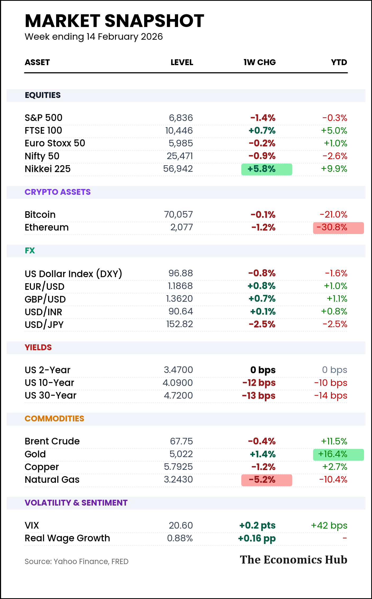
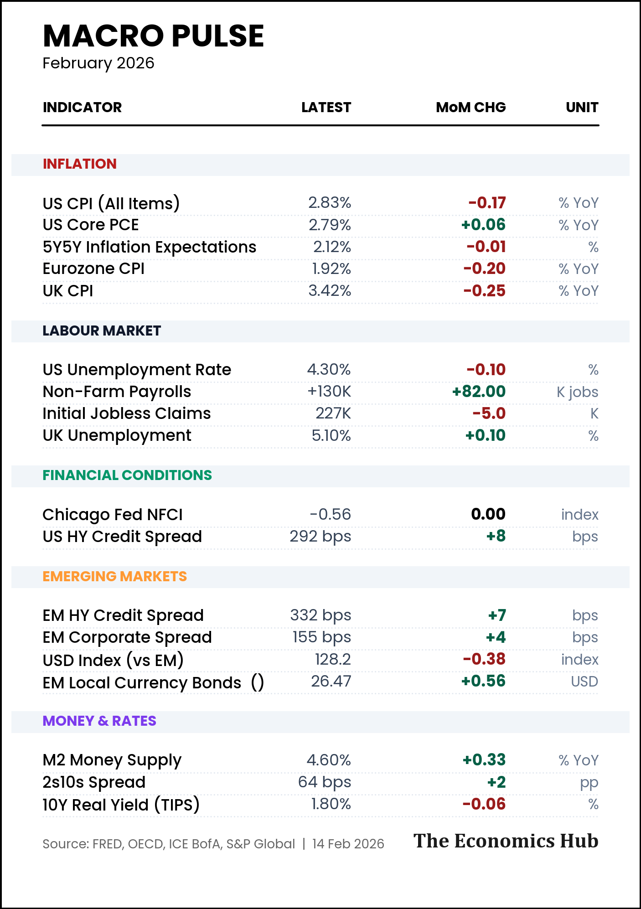
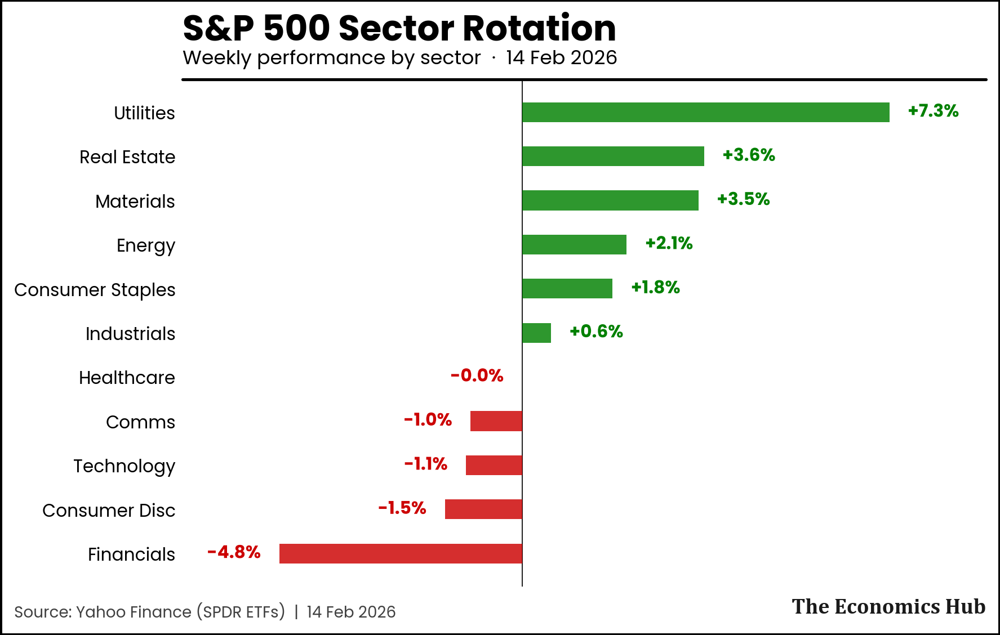
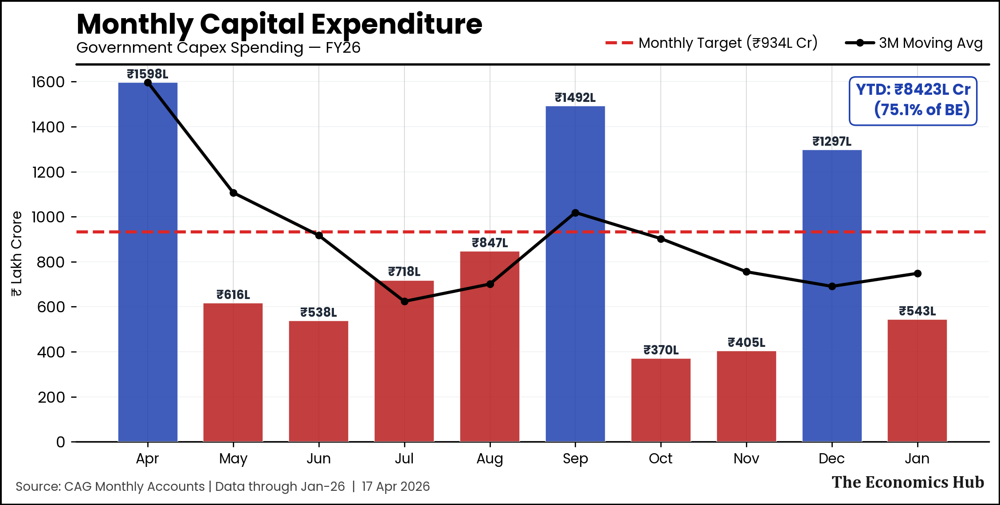
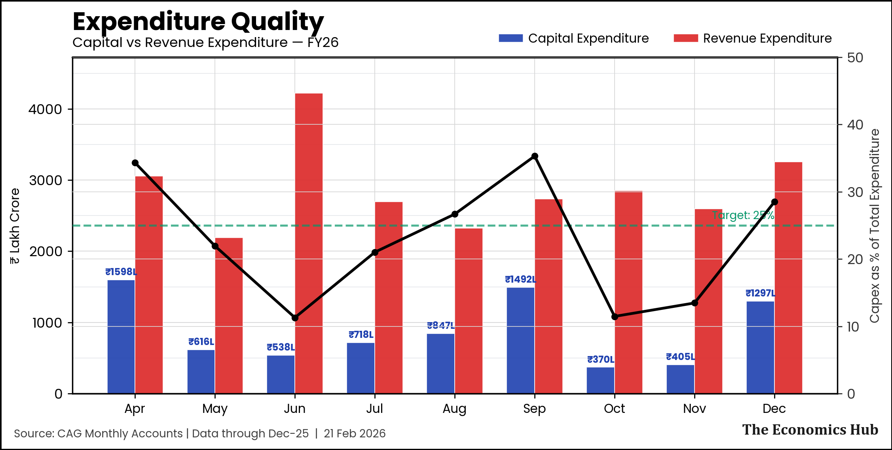
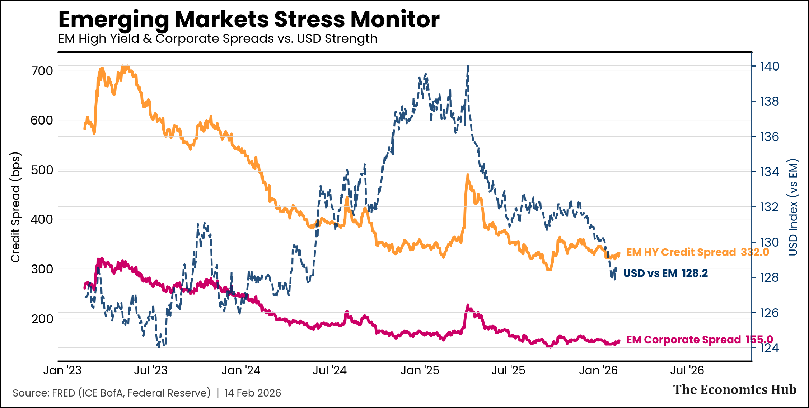

# The Economics Hub — Weekly Macro Dashboard

An automated Python pipeline that generates key macroeconomic charts and tables; tracking Global Equities, Forex, Sovereign Bonds, Commodities, and Indian Market nuances for [The Economics Hub](https://economicshub.substack.com/) Substack newsletter.

Here is the sample snapshot of the macro indicators that feature in my newsletters:

| **🌍 Market Snapshot** | **🧿 Macro Pulse** |
|:---:|:---:|
|  |  |
| **🔄 Sectoral Rotations** | **🛢️ Monthly Capex** |
|  |  |
| **💡Expenditure Quality** | **🔴 EM Stress Monitor** |
|  |  |

---  

## 🔧 Reproducibility Guide

### Prerequisites

Python 3.9+ and a free FRED API key from [fred.stlouisfed.org](https://fred.stlouisfed.org/docs/api/api_key.html).

### Installation

```bash
git clone https://github.com/shreyasxi/the-economics-hub.git
cd the-economics-hub
pip install -r requirements.txt
```

### API Key Configuration

Set your FRED API key as an environment variable. Do **not** hardcode it in source files.

**Windows (PowerShell — permanent):**
```powershell
[System.Environment]::SetEnvironmentVariable("FRED_API_KEY", "your_key_here", "User")
# Restart terminal for it to take effect
```

**macOS / Linux:**
```bash
echo 'export FRED_API_KEY="your_key_here"' >> ~/.bashrc
source ~/.bashrc
```

Verify it works:
```bash
python -c "import os; print(os.environ.get('FRED_API_KEY', 'NOT SET'))"
```
---

## 📁 Project Structure

```
economics_hub/
├── config/
│   ├── settings.py              # Weekly indicators (Yahoo Finance + FRED tickers)
│   └── macro_settings.py        # Monthly macro indicators (FRED + manual data)
├── data/
│   ├── fetchers/
│   │   ├── yf_fetcher.py        # Yahoo Finance data fetcher
│   │   └── fred_fetcher.py      # FRED API data fetcher
│   └── india_manual.csv         # India metrics (manual monthly CSV)
├── charts/templates/
│   ├── trend_line.py            # TrendLineChart — line charts with end labels
│   ├── weekly_bar.py            # WeeklyBarChart — horizontal green/red bars
│   ├── yield_curve.py           # YieldCurveChart — multi-date yield curves
│   └── summary_table.py         # SummaryTable — market snapshot table
├── style/
│   └── economics_hub_style.py   # EconStyle — visual theme (fonts, colours, layout)
├── output/                      # Generated charts (not tracked by git)
│   ├── weekly/YYYY-MM-DD/
│   ├── macro/YYYY-MM/
│   └── india/YYYY-MM/
│   └── custom
├── generate_weekly.py           # Weekly dashboard
├── generate_macro.py            # Monthly macro dashboard
├── generate_india.py            # India macro dashboard
├── make_chart.py                # CLI tool for ad-hoc charts from any CSV
├── requirements.txt
├── .gitignore
└── README.md
```

---

## 📊 Usage

### 1. Weekly Global Dashboard
Generates the standard 12-chart pack (Equities, FX, Yields, Commodities) automatically fetching live data.
```bash
python generate_weekly.py
```

### 2. Weekly Macro Dashboard
Generates the charts that are generally released on a monthly basis. Some India specific indicators might require manual entires.
```bash
python generate_macro.py
```

### 3. India Macro Monitor
Generates the India-specific deep dive (FPI, GST, Credit). **Note:** Ensure ```data/india_manual.csv``` is updated with the latest monthly figures before running.
```bash
python generate_india.py
```
### 4. Ad-Hoc Chart Tool (CLI)
Quickly generate a styled chart from any CSV file without modifying the codebase.
```bash
python make_chart.py
```


---


##  Adding New Indicators

1. Add the indicator definition in `config/settings.py` → `INDICATORS` dict
2. Add it to the relevant section in `DASHBOARD_SECTIONS`
3. The chart templates will pick it up automatically

---


## Data Sources

| Source | Type | Access | Used by |
|--------|------|--------|---------|
| Yahoo Finance | Equities, FX, commodities, crypto, VIX, sector ETFs | Free, no key needed | `generate_weekly.py` |
| FRED | US yields, CPI, PCE, unemployment, claims, M2, NFCI, credit spreads | Free API key | `generate_weekly.py`, `generate_macro.py` |
| Manual CSV | India PMI, GST, bank credit, unemployment, FPI flows | Hand-entered monthly | `generate_india.py` |
| Manual dict | India indicators in macro table | Hand-entered in `macro_settings.py` | `generate_macro.py` |

---

## 📄 License

This project is licensed under the **CC BY-NC 4.0** License.

This project is licensed for **personal and research use only**. You are free to use this code, but you must give appropriate credit to **The Economics Hub**. 

See the [LICENSE](LICENSE) file for details.

---


