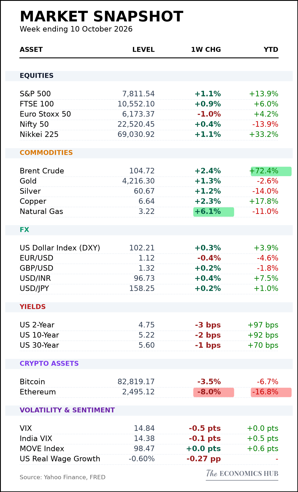
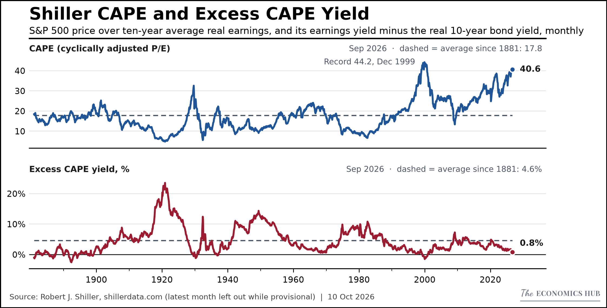
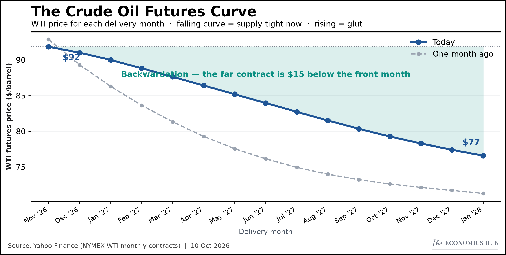
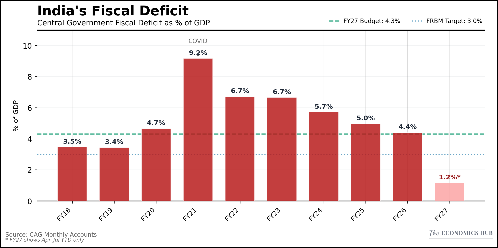
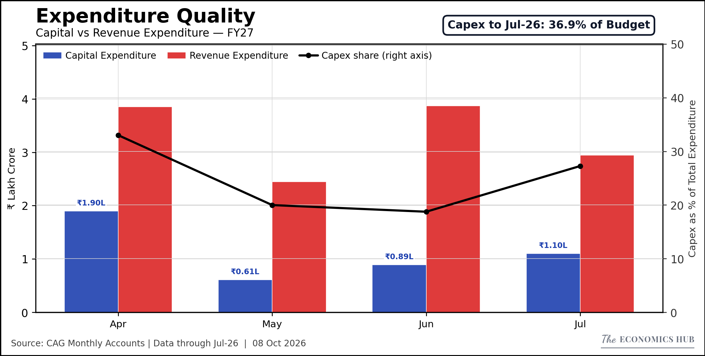
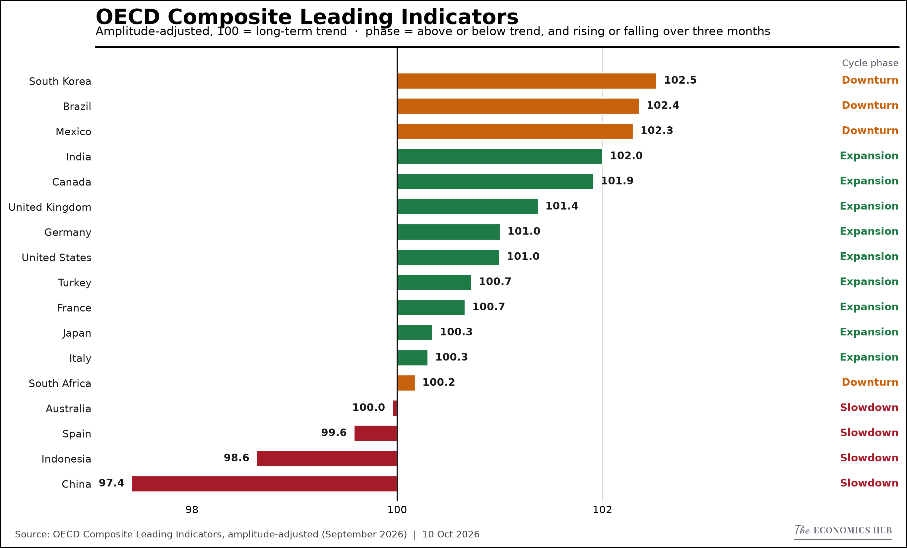

# Automated Macro Dashboard & RBI Sentiment Tracker

Weekly charts and analysis on global markets, the world economy, India and the RBI.

An automated Python pipeline tracking global equities, forex, sovereign bonds, commodities and Indian markets, published via [The Economics Hub on Substack](https://economicshub.substack.com/).

<p align="center">
  <a href="https://weekly-macro-dashboard.streamlit.app/">
    
  </a>
</p>

---

## Featured research: RBI Sentinel

A tone index for Indian monetary policy, built from **285 Reserve Bank documents across 61 policy
cycles since 2016** (159 of them scored: 61 MPC Resolutions, 61 sets of Minutes and 37 Governor's Statements), with a pre-registered live test running from October 2026 on whether it
predicts the bond market's reaction to a decision.

It reports its negative results as prominently as its positive one: tone does **not** predict the
rate decision once the RBI's stated stance is known, and shows no reliable relationship with
equities or the rupee. What it does track is the 10-year government security's move on decision day.

**→ [Read the write-up](https://shreyasxi.github.io/economics-hub/#sentinel)** · [see it live](https://weekly-macro-dashboard.streamlit.app/rbi-sentinel)

---

## Sample Charts

| **Market Snapshot** | **World: Shiller CAPE and Excess CAPE Yield** |
|:---:|:---:|
|  |  |
| **The Crude Oil Futures Curve** | **Fiscal Deficit** |
|  |  |
| **Expenditure Quality** | **World: OECD Composite Leading Indicators** |
|  |  |

*Charts update automatically after each pipeline run — images always reflect the latest data.*

---

## Reproducibility Guide

### Prerequisites

Python 3.9+ and a free FRED API key from [fred.stlouisfed.org](https://fred.stlouisfed.org/docs/api/api_key.html).

### Installation

```bash
git clone https://github.com/shreyasxi/the-economics-hub.git
cd the-economics-hub
pip install -r requirements.txt
```

### API Key Configuration

**Windows (PowerShell — permanent):**
```powershell
[System.Environment]::SetEnvironmentVariable("FRED_API_KEY", "your_key_here", "User")
# Restart terminal to take effect
```

**macOS / Linux:**
```bash
echo 'export FRED_API_KEY="your_key_here"' >> ~/.bashrc
source ~/.bashrc
```

---

## Project Structure

```
economics_hub/
├── app.py                       # Streamlit dashboard: 5 pages and About, each with its own link
├── generate_weekly.py           # Weekly global dashboard (40 charts, every Saturday via CI)
├── generate_news.py             # Weekly page: The Week in Headlines (collects every 4 hours, ranks with the weekly charts)
├── generate_macro.py            # World page: central banks, six-economy scoreboard, 12 charts (Saturdays via CI)
├── generate_india.py            # India charts, Saturdays via CI + manual
├── generate_soe.py              # India page: RBI's State of the Economy (briefing + rate transmission history)
├── generate_rbi_sentinel.py     # RBI MPC sentiment pipeline (automated via CI)
├── generate_signals.py          # Analysis page: Signal or noise, 52 markets' weekly moves against their typical week
│
├── charts/
│   ├── make_chart.py            # CLI tool for ad-hoc charts from CSV/Excel
│   ├── style.py                 # EconStyle — all visual constants and chart methods
│   ├── loader.py                # Finds the latest published charts for the dashboard
│   └── templates/               # Reusable chart template classes
├── config/
│   ├── settings.py              # Weekly indicators (Yahoo Finance + FRED tickers)
│   ├── macro_settings.py        # World page: US and emerging-market series (FRED)
│   ├── world_settings.py        # World page: countries, sources, central bank calendars
│   ├── news_settings.py         # Headline feeds, themes and filters
│   ├── analysis.py              # Analysis page: What I'm watching threads and pinned essays (edited by hand)
│   ├── signals_settings.py      # Analysis page: the 52 series on the Signal or noise board
│   └── insights.py              # Chart explanations shown under each chart
├── data/
│   ├── fetchers/                # yfinance, FRED, India, GMD, MoSPI and NSE fetchers
│   │   └── nse_valuations/      # NSE valuation collector and production calculations
│   ├── nse_indices.py          # Validated NSE price-index import and signal loading
│   ├── nse_indices/            # NSE raw sources, manifest and risk-appetite signal
│   ├── nse_valuations/         # Valuation data only: source archives, tables and readiness
│   ├── gmd_investment.csv/json  # Saved India investment-rate data and provenance
│   ├── india_manual_entry.py    # CLI for monthly India figures (PMI, GST, CPI, IIP)
│   ├── world_snapshot.py        # World page data: BIS, OECD, Eurostat, central banks, FRED
│   ├── news.py                  # Headlines: RSS reading, theme sorting, story ranking
│   ├── signals.py               # Analysis page: weekly move ÷ typical week, and "largest since"
│   ├── substack.py              # Analysis page: the newsletter shelf, read from Substack
│   ├── world_manual_entry.py    # CLI for World figures with no free API (PMIs, Japan CPI, China)
│   ├── valuations.py            # World page: Shiller CAPE, Damodaran equity risk premium and country risk downloads
│   ├── india_macro.db           # India SQLite database
│   ├── cag_monthly_accounts.xlsx # India CAG fiscal data
│   └── rbi_sentinel.db          # RBI MPC documents, scores and rate decisions
├── rbi_sentinel/                # RBI Sentinel package (fetch, score, charts)
│   ├── research/                # Research charts drawn outside the pipeline
│   └── seed_rates.py            # Repo-rate history corrections
├── tests/                       # Guards against silently wrong numbers (units, staleness, date alignment)
├── assets/                      # Git-tracked PNGs served by Streamlit Cloud
│   ├── weekly/YYYY-MM-DD/       # Newest 4 editions kept (monthly folders too)
│   ├── macro/YYYY-MM/
│   ├── india/YYYY-MM/
│   ├── rbi_sentinel/YYYY-MM/
│   ├── rbi_research/
│   ├── analysis/                # Charts saved by hand for the Analysis page's threads
│   ├── brand/                   # Logo, and the source of the link-preview card
│   └── readme_showcase/         # Static-named flagship charts (always current)
├── site/                        # Link-preview front door on GitHub Pages: shreyasxi.github.io/the-economics-hub
├── output/                      # Local generation output (git-ignored)
└── .github/                     # GitHub Actions workflows and helper scripts
```

---

## Usage

### 1. Weekly Global Dashboard
Generates 40 charts (Equities, Commodities, Yields, FX, Cross-Asset, Crypto) — runs automatically every Saturday via GitHub Actions. Commodities covers the WTI futures curve (contango vs backwardation), gold against real interest rates and a 13-market breadth measure.

The same run adds **The Week in Headlines**: the week's top World and India stories from publisher RSS feeds, one per theme (central banks, inflation, trade, energy, growth, markets, public finances), ranked by how many outlets covered each, then by how many days each stayed in the news. Headlines are the publishers' own and link to the original. Some feeds hold only hours of stories, so a separate workflow collects every feed every 4 hours into a pool of the week's headlines. The pool lives in GitHub's Actions cache, never in the repository, and keeps 8 days at most. If the feeds fail, the charts still publish without the strip; if the pool is missing, the feeds are read once instead.
```bash
python generate_weekly.py
python generate_news.py --collect   # add the feeds' current headlines to the week's pool
python generate_news.py             # rank the week for the newest weekly edition
```

### 2. World
Central bank rates and meeting dates, a six-economy scoreboard (US, euro area, UK, Japan, China, India), the global rate cycle (how many of 38 central banks are hiking or cutting each month), a five-week calendar, and US, equity valuation, country risk, emerging-market and global growth charts — runs every Saturday via GitHub Actions, with central bank rates rechecked twice every weekday from the banks' own announcements. Figures with no free API (manufacturing PMIs, Japan CPI, China unemployment and 10-year yield) are entered with a CLI.
```bash
python -m data.world_manual_entry status
python generate_macro.py
```

### 3. India
Generates India charts covering FPI, risk appetite, sector valuations and rotation, investment, GVA growth contributions, GST, fiscal accounts, credit and trade — runs every Saturday via GitHub Actions. Monthly figures without an API (PMI, GST, CPI, IIP) are entered with the manual-entry CLI.

The RBI State of the Economy reader prefers HTML and falls back to the PDF
linked alongside the article in the Bulletin contents. PDF dates and transmission
table columns are validated before use. If RBI returns a CAPTCHA instead of the
PDF, download it in your browser and run
`python generate_soe.py --month YYYY-MM --pdf-file /path/to/report.pdf`.
The official source URL is still discovered from the Bulletin contents page.
Unrecognised PDF layouts require review; no figures are inferred from them.
The PDF request uses the Bulletin page as its referrer. Regression tests include
RBI's September 2026 PDF and verify the conclusion across pages and columns,
plus the distinction between fresh-loan interest-rate effects and outstanding
loan rates. Existing loans use the final table column; HTML merged headers and
PDF column boundaries determine the mapping.
```bash
python -m data.india_manual_entry status
python generate_india.py
python generate_soe.py              # RBI's State of the Economy: briefing + transmission history
python generate_soe.py --history    # read any editions missing from data/rbi_transmission.csv
```

### India data refresh and publication

Run these commands from the repository root after installing `requirements.txt`:

```bash
python -m data.fetchers.nse_risk_appetite
python -m data.fetchers.nse_valuations.collector --update
python -m data.fetchers.nse_valuations.collector --verify
python -m unittest discover -s tests -p "test_nse*.py" -v
python generate_india.py --mode dashboard
```

The committed NSE stores provide the starting history for a fresh checkout; normal
updates do not need the original annual export folders. For a new risk-appetite
store, place official annual price-index exports in `data/NIFTY 50/` and
`data/NIFTY Small Cap 250/` (local, gitignored), then run
`python -m data.fetchers.nse_risk_appetite --bootstrap --seed-only`.
Risk appetite rebases the Smallcap 250 / NIFTY 50 price-index ratio to 100 on
4 October 2016, using matching dates without filling gaps.

NSE valuation code lives in `data/fetchers/nse_valuations/`; its default store
remains `data/nse_valuations/`. Keep raw `sources/`, source manifests, normalized
tables and current/readiness snapshots tracked: the loader validates their
checksums and exact source values. Run logs under both NSE stores are local only.
Valuation refreshes catch up missing months and revalidate the latest archive.
P/E reference history starts April 2021; P/B uses up to 120 completed months
(Oil & Gas starts January 2020). The current source month is excluded, at least
60 valid observations are required, and percentile is the percentage of valid
historical values at or below the current multiple. Failed refreshes omit the
optional valuation chart rather than publish stale values.

Refresh the saved investment-rate snapshot explicitly with
`python -m data.fetchers.gmd_investment`; keep both its CSV and JSON provenance.
MoSPI GVA refreshes through the India fetcher's append step, or independently
with `python -m data.fetchers.mospi_gva`; `--dry-run` validates without writing.
The chart reads the validated quarterly series in `data/india_macro.db`.
If the MoSPI API reports `UNSAFE_LEGACY_RENEGOTIATION_DISABLED`, its client
retries once with legacy-server TLS compatibility restricted to
`api.mospi.gov.in`; certificate and hostname verification remain enabled.

Pushing code updates the application, but does not run the India generator.
To publish fresh charts immediately, open GitHub Actions → **India Dashboard
Generator** → **Run workflow**, choose `main`, and leave `skip_fetch` as `false`
for the full refresh. The workflow generates charts, copies them from ignored
`output/` to tracked `assets/india/`, and commits the published data and assets.
It also runs automatically on Saturdays at 13:30 IST.

### 4. Reserve Bank of India Policy Related Charts
Scores the tone of RBI Monetary Policy Committee documents and charts it against rate decisions — runs automatically via GitHub Actions (needs an `ANTHROPIC_API_KEY`).
```bash
python generate_rbi_sentinel.py
```

### 5. Ad-Hoc Chart Tool
Quickly generate a styled chart from any CSV without modifying the codebase.
```bash
python charts/make_chart.py
```

---

## Data Sources

| Source | Type | Access | Used by |
|--------|------|--------|---------|
| Yahoo Finance | Equities, FX, commodities, ETFs, VIX, NIFTY IT | Free, no key | `generate_weekly.py`, `generate_india.py` |
| NSE (nseindia.com) | NIFTY sector index levels and their 1-week and 1-year changes; official price-index archives and sector valuation histories | Free, no key | `generate_weekly.py`, `generate_india.py` |
| Coin Metrics Community API | Bitcoin MVRV, price and market value, daily since 2010 | Free, no key | `generate_weekly.py` |
| OECD Data Explorer (SDMX) | Monthly broad money of the US, China, euro area, Japan, UK, Canada and Australia, summed in dollars as global M2 | Free, no key | `generate_weekly.py` |
| FRED | US yields, CPI, PCE, unemployment, credit spreads (ICE BofA, latest three years only since April 2026), EM corporate bond yields, EM dollar index, exchange rates, US recession dates, Fed and ECB rates, US release calendar | Free API key | `generate_weekly.py`, `generate_macro.py` |
| OECD · BIS · Eurostat · Bundesbank · Bank of England · Federal Reserve · MoF Japan | CPI, unemployment, leading indicators, policy rates, 10-year yields | Free, no key | `generate_macro.py` |
| Robert J. Shiller (shillerdata.com) · Aswath Damodaran (NYU Stern) | CAPE and excess CAPE yield; implied equity risk premium; country and regional equity risk premiums | Free spreadsheets, downloaded each run | `generate_macro.py` |
| RBI DBIE workbook | India credit, M3, FPI flows, forex reserves, trade | Free, refreshed monthly | `generate_india.py` |
| Manual entry + CAG workbook | India PMI, GST, CPI, IIP, FPI (NSDL); CAG fiscal accounts | Hand-entered monthly | `generate_india.py` |
| rbi.org.in | RBI MPC documents (HTML, cached locally) | Free | `generate_rbi_sentinel.py` |
| Publisher RSS feeds: BBC News, The Guardian, CNBC, Financial Times, Bloomberg, Mint, Business Standard, BusinessLine, The Indian Express | Headlines and links only | Free, no key | `generate_news.py` |

\* **A note on the scored RBI database.** `data/rbi_sentinel.db` holds ten years of MPC Resolutions, Minutes and
Governor's Statements scored by a large language model. It ships with this repository so the pipeline and dashboard are
fully reproducible, but it was expensive to build and is not something you can recreate for free. Under CC BY-NC 4.0 it
is available for personal and research use with credit to **The Economics Hub**, and not for commercial use.
*If you would like to use this dataset in your own work, please get in touch first at
[shreyasurgunde20@gmail.com](mailto:shreyasurgunde20@gmail.com) — I am glad to share it, I would just like to know where it goes.*

---

## License

Licensed under **CC BY-NC 4.0** — free for personal and research use with credit to **The Economics Hub**.  
See the [LICENSE](LICENSE) file for details.
