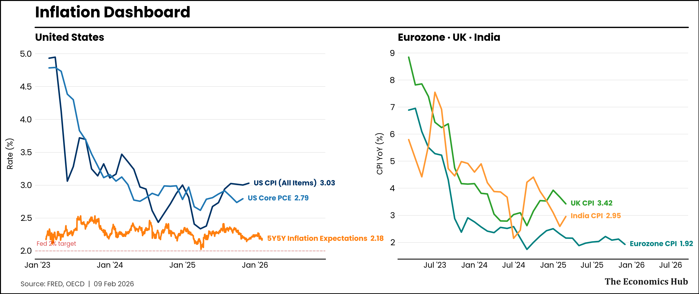
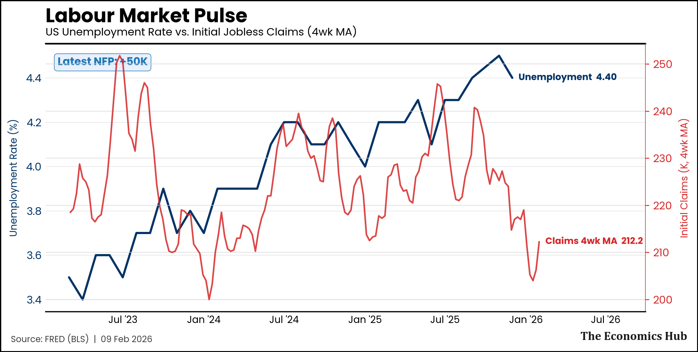
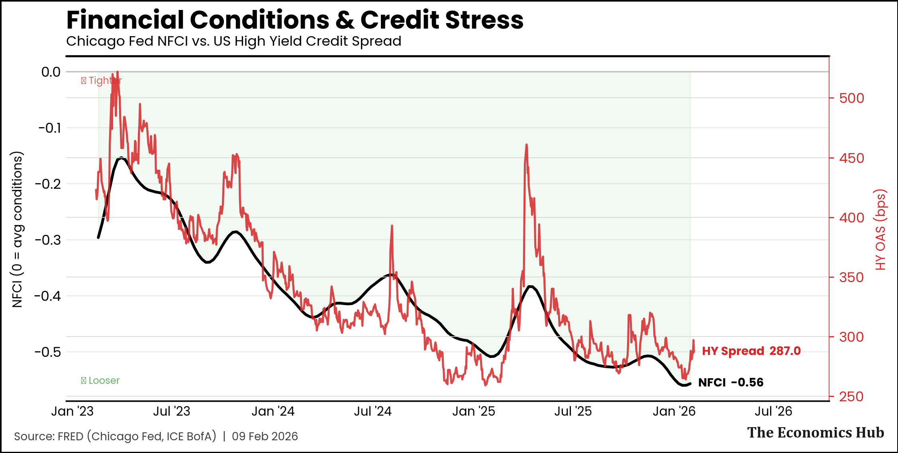
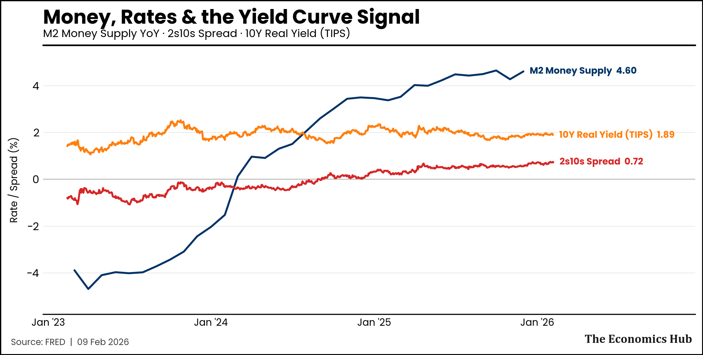
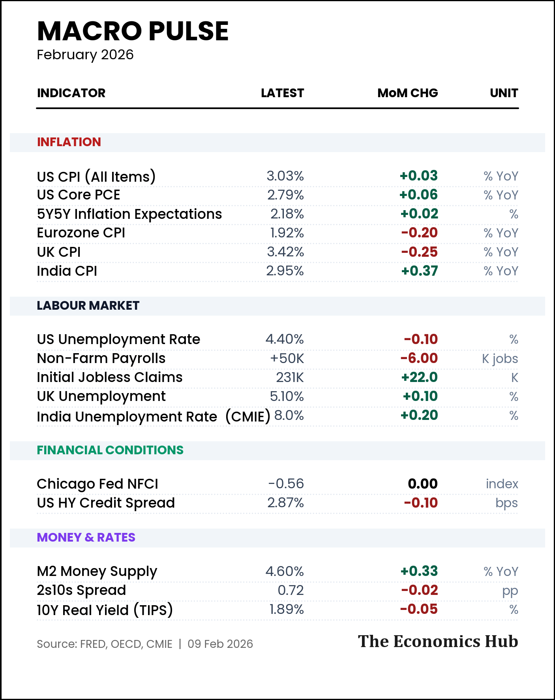

# Macro Pulse — February 2026

---

## Inflation Dashboard

> **Key takeaway:** [One sentence on the inflation picture — is it cooling, sticky, or diverging across regions?]

---

## Labour Market

> **Key takeaway:** [One sentence — is the labour market tightening, loosening, or stable?]

---

## Financial Conditions & Credit

> **Key takeaway:** [One sentence — are conditions easing or tightening? Any credit stress signals?]

---

## Money, Rates & the Yield Curve

> **Key takeaway:** [One sentence — what is money supply doing? Is the yield curve signalling anything?]

---

## Macro Summary

---

## The Deep Dive

*[This is your 400-600 word original analysis. Pick ONE theme from the macro dashboard and explain why it matters for markets in the next 1-3 months. Connect the dots between two or more indicators.]*

**[Title of your insight]**

[Your analysis here...]

---

*The Economics Hub — Global finance through multiple lenses.*
