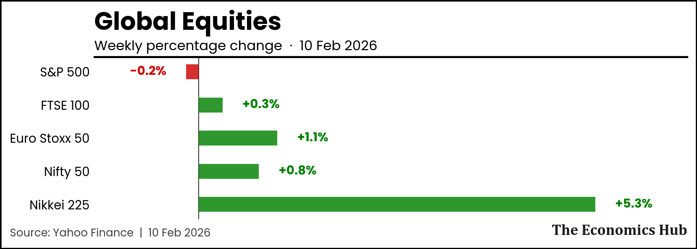
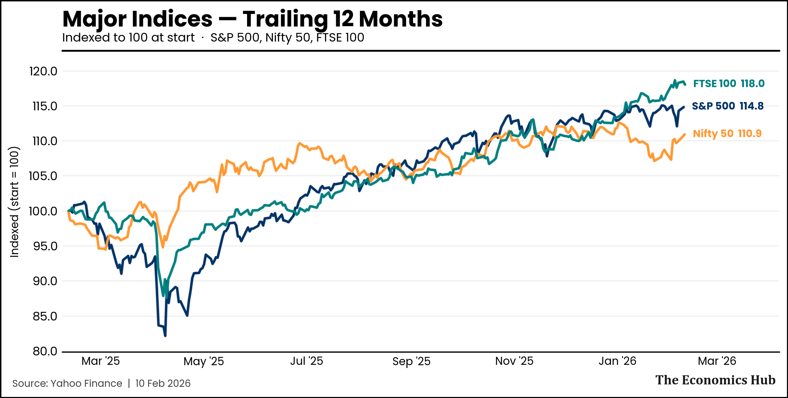
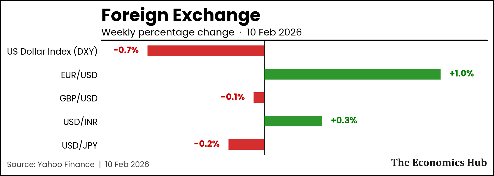
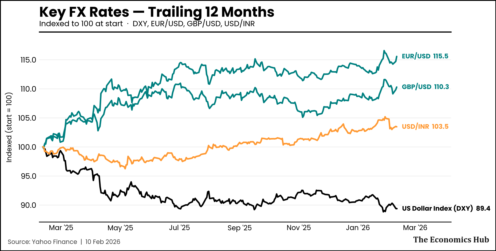
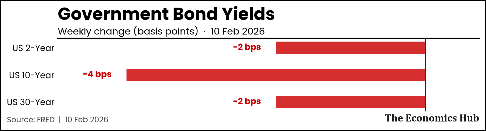
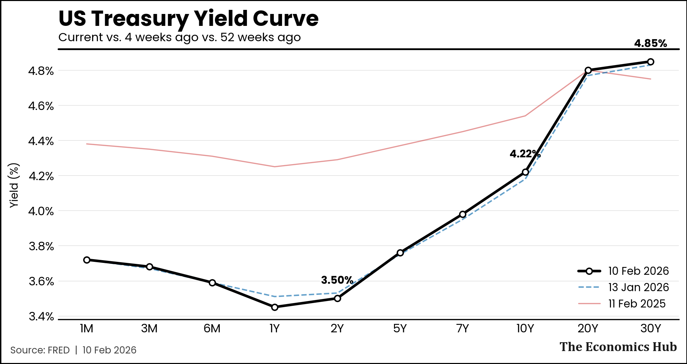
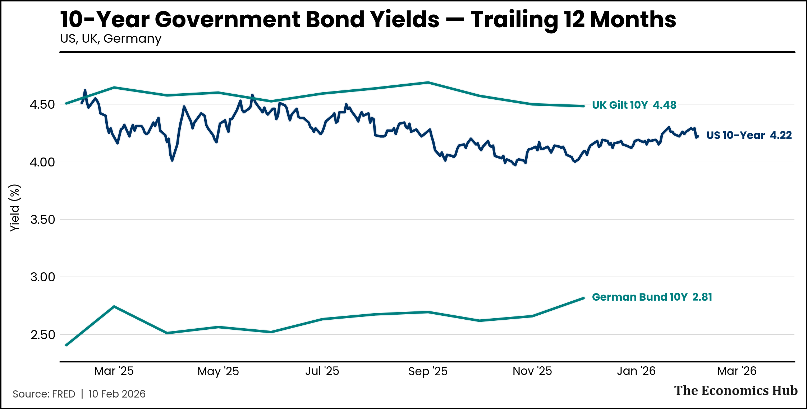
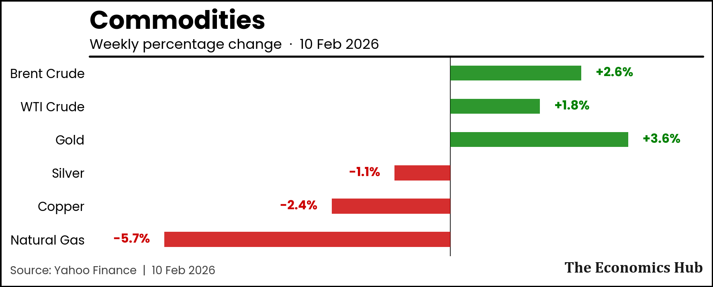
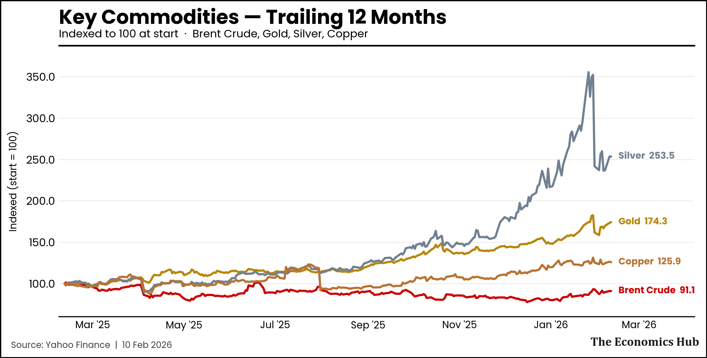
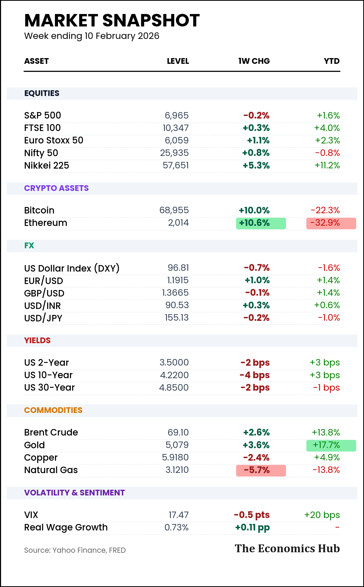

# The Weekly Pulse — Week 7
*10 February 2026*

---

Happy Saturday! Here's your weekly macro dashboard.

---

## Global Equities

> **One-liner:** [Your one-sentence summary of equity markets this week]

---

## Foreign Exchange

> **One-liner:** [Your one-sentence summary of FX moves]

---

## Government Bond Yields

> **One-liner:** [Your one-sentence summary of yield movements]

---

## Commodities

> **One-liner:** [Your one-sentence summary of commodity moves]

---

## The Signal

*[This is where you write 300-500 words of original analysis. Pick one thing from the dashboard that caught your attention and explain WHY it matters.]*

**[Title of your insight]**

[Your analysis here...]

---

## Market Snapshot

---

*The Economics Hub — Global finance through multiple lenses.*

*If you found this useful, please share it with someone who'd appreciate rigorous macro analysis.*

[Subscribe](https://yoursubstack.substack.com)
